# Railly — Activity Diagrams (Mermaid)

> **System:** Railly — Transit Safety Incident Management System  
> All diagrams use Mermaid `flowchart TD` syntax.  
> Render with VS Code Mermaid extension, Mermaid Live Editor, or any Mermaid-compatible tool.

---

## Table of Contents

1. [User Registration & MFA Setup](#1-user-registration--mfa-setup)
2. [Login with MFA Verification](#2-login-with-mfa-verification)
3. [Password Recovery (Forgot Password)](#3-password-recovery-forgot-password)
4. [Change Password (Authenticated)](#4-change-password-authenticated)
5. [Session Management & Auto-Logout](#5-session-management--auto-logout)
6. [Passenger: Submit Incident Report (with Offline Support)](#6-passenger-submit-incident-report-with-offline-support)
7. [Passenger: Track Report & Request Escalation](#7-passenger-track-report--request-escalation)
8. [Operator: Alert Management Lifecycle](#8-operator-alert-management-lifecycle)
9. [Operator: Dashboard & Report Generation](#9-operator-dashboard--report-generation)
10. [Operator: User Account Management](#10-operator-user-account-management)
11. [Operator: Shift Schedule Management](#11-operator-shift-schedule-management)
12. [Auxiliary: Shift Detection & Alert Response](#12-auxiliary-shift-detection--alert-response)
13. [Push Notification Subscription & Real-time Delivery](#13-push-notification-subscription--real-time-delivery)
14. [Offline Queue: Report Sync on Reconnection](#14-offline-queue-report-sync-on-reconnection)

---

## 1. User Registration & MFA Setup

> **Actor:** Passenger (only role that can self-register)  
> **Trigger:** User navigates to the Sign Up page  
> **Outcome:** Account created with MFA configured, redirected to Login

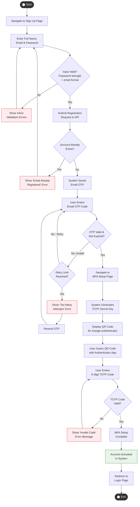

---

## 2. Login with MFA Verification

> **Actors:** Passenger, Operator, Auxiliary Staff  
> **Trigger:** User navigates to the Login page  
> **Outcome:** Authenticated session established; user redirected to role-specific interface

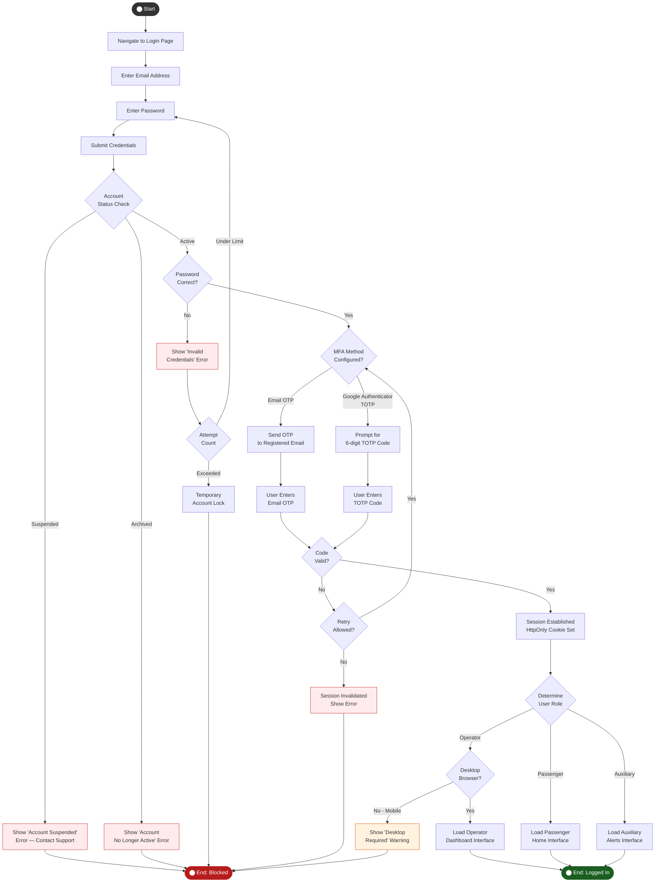

---

## 3. Password Recovery (Forgot Password)

> **Actors:** Passenger, Operator, Auxiliary Staff  
> **Trigger:** User clicks "Forgot Password" on Login page  
> **Outcome:** Password successfully reset; user redirected to Login

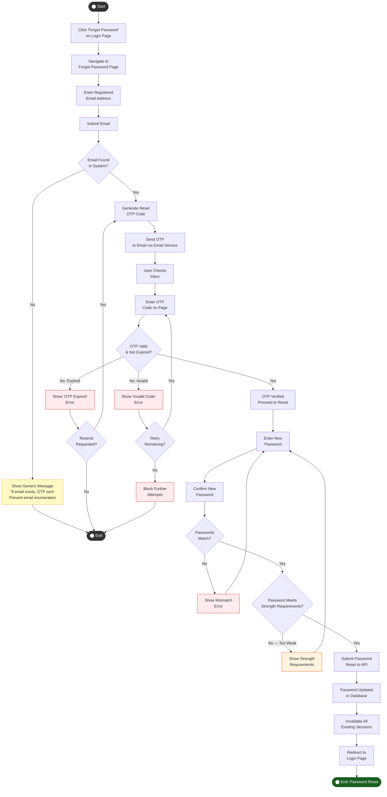

---

## 4. Change Password (Authenticated)

> **Actors:** Passenger, Operator, Auxiliary Staff  
> **Trigger:** User navigates to Change Password from their profile/settings  
> **Outcome:** Password updated; session remains active

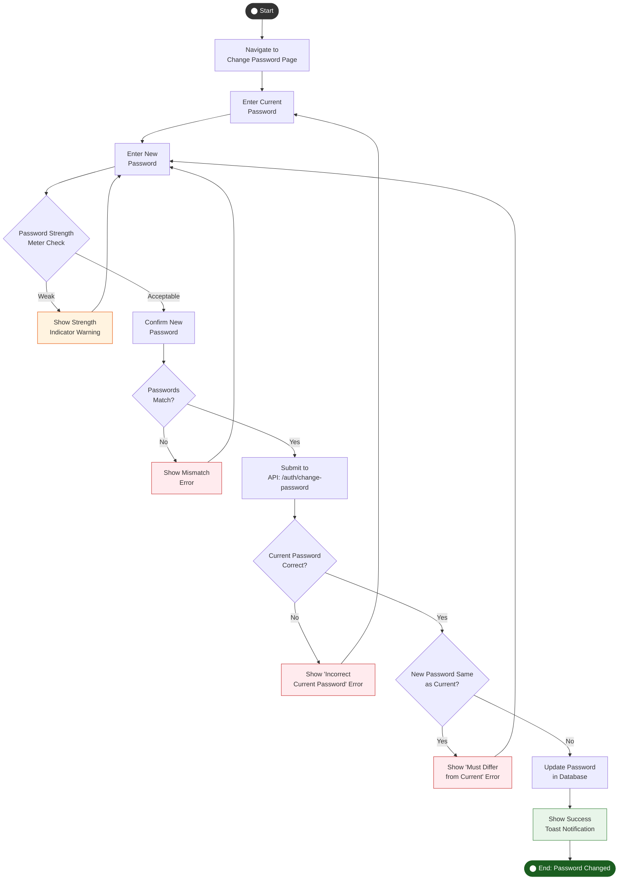

---

## 5. Session Management & Auto-Logout

> **Actors:** Passenger, Operator, Auxiliary Staff  
> **Trigger:** User is authenticated and idle / receives 401 response  
> **Outcome:** User safely logged out; sensitive cache cleared

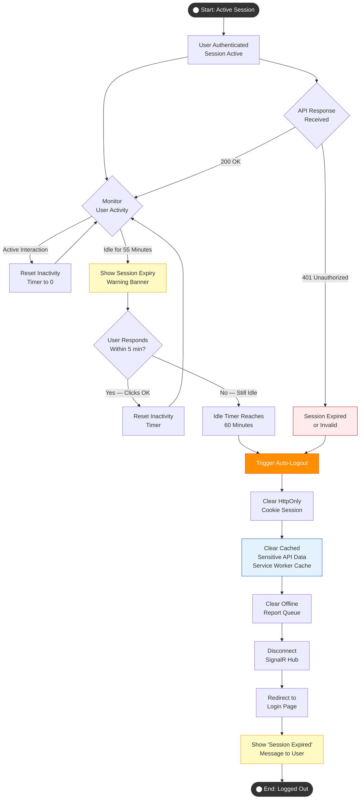

---

## 6. Passenger: Submit Incident Report (with Offline Support)

> **Actor:** Passenger  
> **Trigger:** Passenger witnesses an incident and taps "Report Incident"  
> **Outcome:** Report submitted to server (or queued offline for later sync)

```mermaid
flowchart TD
    START(["⬤ Start"])
    START --> A[Tap 'Report Incident'\nButton]
    A --> B{GPS Permission\nGranted?}
    B -->|Yes| C[Fetch Device\nGPS Coordinates]
    C --> D{Nearby Station\nDetected?}
    D -->|Yes| E[Auto-fill Detected\nLine & Station]
    D -->|No - Out of Range| F[Prompt Manual\nStation Selection]
    B -->|No / Denied| F
    E --> G[User Confirms or\nChanges Location]
    F --> G
    G --> H[Step 2: Select\nTrain Number]
    H --> I[Select Coach\nNumber]
    I --> J[Select Door /\nPlatform]
    J --> K[Step 3: Select\nIncident Type]

    K --> L{Add Photo\nEvidence?}
    L -->|Yes| M{Photo Source}
    M -->|Camera| N[Launch Device\nCamera]
    M -->|Gallery| O[Open Photo\nGallery Picker]
    N --> P[Capture Photo]
    O --> P
    P --> Q[Attach Photo\nto Report]
    L -->|No - Skip| R[Step 4: Enter\nIncident Description]
    Q --> R

    R --> S[Preview Report\nSummary Screen]
    S --> T{Submit\nReport?}
    T -->|Edit| A
    T -->|Cancel| END1(["⬤ End: Cancelled"])
    T -->|Submit| U{Network\nAvailable?}

    U -->|Online| V[POST Report to\n/api/data/incident-reports]
    U -->|Offline| W[Serialize Report\nto Local Storage Queue]
    W --> X[Show Offline\nStatus Banner]
    X --> Y[Show 'Queued for\nSync' Confirmation]
    Y --> END2(["⬤ End: Report Queued"])

    V --> Z{Server\nResponse}
    Z -->|201 Created| AA[Show Success Screen\nwith Incident ID]
    Z -->|Server Error| AB[Show Retry\nOption]
    AB --> V
    AA --> AC[Report Appears in\n'My Reports' History]
    AC --> END3(["⬤ End: Report Submitted"])

    style START fill:#333,color:#fff,stroke:#333
    style END1 fill:#333,color:#fff,stroke:#333
    style END2 fill:#E65100,color:#fff,stroke:#BF360C
    style END3 fill:#1B5E20,color:#fff,stroke:#1B5E20
    style W fill:#FFF3E0,stroke:#E65100
    style AA fill:#E8F5E9,stroke:#2E7D32
    style AB fill:#FFEBEE,stroke:#C62828
```

---

## 7. Passenger: Track Report & Request Escalation

> **Actor:** Passenger  
> **Trigger:** Passenger opens "My Reports" to check on a submitted report  
> **Outcome:** Passenger stays informed; optionally requests escalation or adds a comment

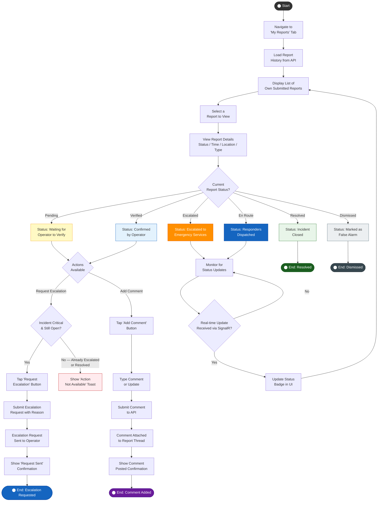

---

## 8. Operator: Alert Management Lifecycle

> **Actor:** Operator (primary), Auxiliary Staff (supporting), AI Detection System (initiator)  
> **Trigger:** New alert arrives via AI camera detection or passenger report  
> **Outcome:** Alert fully resolved or dismissed with complete audit trail

```mermaid
flowchart TD
    START(["⬤ Start: Alert Event"])
    START --> A{Alert Source}
    A -->|AI Camera| B[AI System Detects\nAnomalous Event]
    A -->|Passenger Report| C[Passenger Submits\nIncident Report via App]
    B --> D[AI Creates Alert Record\nwith Confidence Score & Snapshot]
    C --> E[System Creates Alert Record\nSource: Passenger]
    D --> F[SignalR Hub Broadcasts\nAlert to Operator]
    E --> F
    F --> G[Operator Receives\nPush Notification]
    G --> H[Unread Badge Count\nIncremented in Sidebar]
    H --> I[Operator Opens\nLive Alert Feed]
    I --> J[Click Alert to\nOpen Detail View]
    J --> K[Review Alert Info\nLine / Station / Train / Coach / Type]
    K --> L{Evidence\nAvailable?}
    L -->|Yes - Camera Snapshot| M[Open Image\nLightbox Viewer]
    M --> N[Review Visual\nEvidence]
    N --> O{Operator\nAssessment}
    L -->|No Image| O

    O -->|FALSE ALARM| P[Click 'Dismiss' Button]
    P --> P1[Enter Dismissal\nJustification Comment]
    P1 --> P2[Confirm Action]
    P2 --> P3[Alert Status → Dismissed]
    P3 --> P4[Audit Trail Entry:\nDismissed By + Time + Comment]
    P4 --> END1(["⬤ End: Alert Dismissed"])

    O -->|VALID INCIDENT| Q[Click 'Verify' Button]
    Q --> Q1[Enter Verification\nComment / Note]
    Q1 --> Q2[Confirm Action]
    Q2 --> Q3[Alert Status → Verified]
    Q3 --> Q4[Audit Trail Entry:\nVerified By + Time + Comment]
    Q4 --> R{Severity Level\nAssessment}

    R -->|Low / Moderate\nStation Staff Can Handle| S[Assign to Auxiliary\nStaff at Station]
    S --> S1[Auxiliary Staff Receives\nPush Notification]
    S1 --> S2[Auxiliary Marks\nAlert 'En Route']
    S2 --> S3[Auxiliary Arrives\nat Scene]
    S3 --> S4[Auxiliary Marks\nAlert 'Resolved']

    R -->|High / Critical\nEmergency Response Needed| T[Click 'Escalate' Button]
    T --> T1[Enter Escalation\nReason & Comment]
    T1 --> T2[Confirm Action]
    T2 --> T3[Alert Status → Escalated]
    T3 --> T4[Notify Emergency\nServices External]
    T4 --> T5[Audit Trail Entry:\nEscalated By + Time + Comment]
    T5 --> U[Operator Clicks\n'Mark En Route']
    U --> U1[Enter En Route\nComment]
    U1 --> U2[Alert Status → En Route]
    U2 --> U3[Audit Trail Entry:\nEn Route By + Time + Comment]
    U3 --> V[Responders Arrive\nat Incident Location]

    S4 --> W[Operator Verifies\nResolution]
    V --> W
    W --> X[Click 'Resolve' Button]
    X --> X1[Enter Resolution\nSummary Comment]
    X1 --> X2[Confirm Action]
    X2 --> X3[Alert Status → Resolved]
    X3 --> X4[Full Audit Trail\nRecorded & Complete]
    X4 --> END2(["⬤ End: Alert Resolved"])

    style START fill:#333,color:#fff,stroke:#333
    style END1 fill:#546E7A,color:#fff,stroke:#37474F
    style END2 fill:#1B5E20,color:#fff,stroke:#1B5E20
    style P3 fill:#ECEFF1,stroke:#546E7A
    style Q3 fill:#E3F2FD,stroke:#1565C0
    style T3 fill:#FF8F00,color:#fff,stroke:#E65100
    style U2 fill:#1565C0,color:#fff,stroke:#0D47A1
    style X3 fill:#E8F5E9,stroke:#2E7D32
    style T4 fill:#FFEBEE,stroke:#C62828
```

---

## 9. Operator: Dashboard & Report Generation

> **Actor:** Operator  
> **Trigger:** Operator opens Dashboard or navigates to Reports  
> **Outcome:** Data viewed and optionally exported as PDF

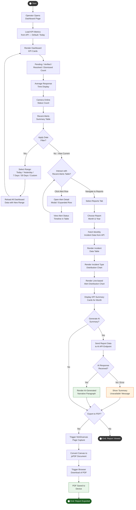

---

## 10. Operator: User Account Management

> **Actor:** Operator  
> **Trigger:** Operator opens User Management page  
> **Outcome:** User status updated (Suspended / Reactivated / Archived)

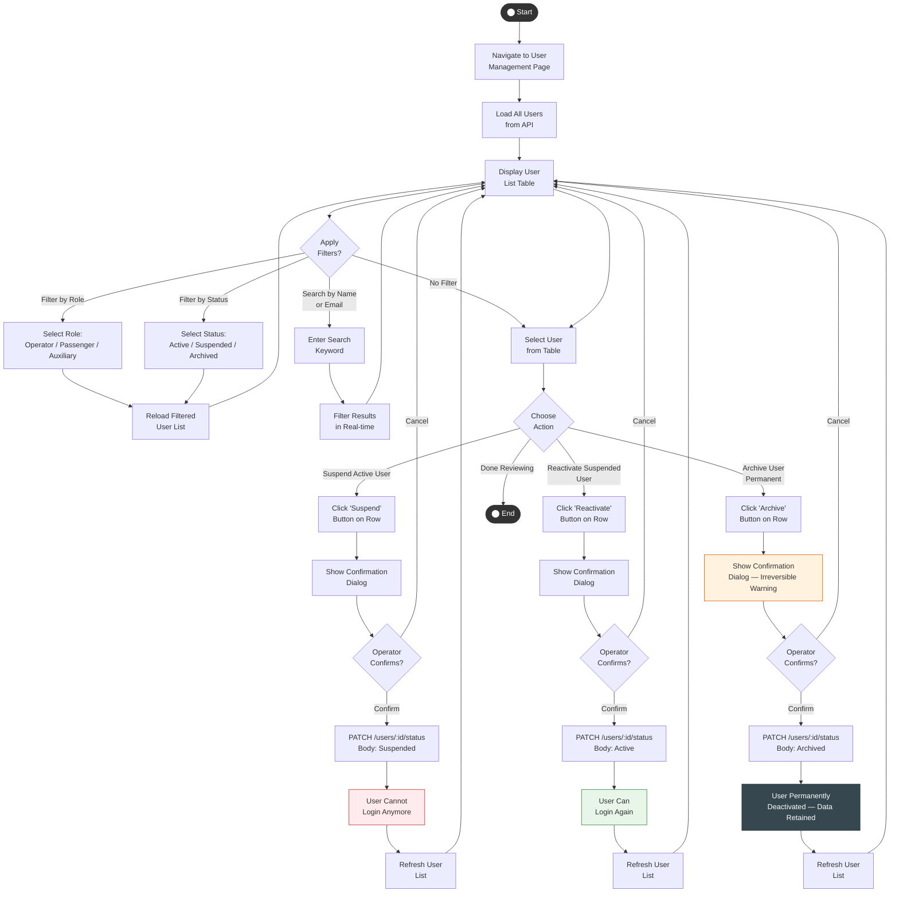

---

## 11. Operator: Shift Schedule Management

> **Actor:** Operator  
> **Trigger:** Operator opens Shift Management page  
> **Outcome:** Shifts viewed, filtered, or bulk-uploaded via CSV

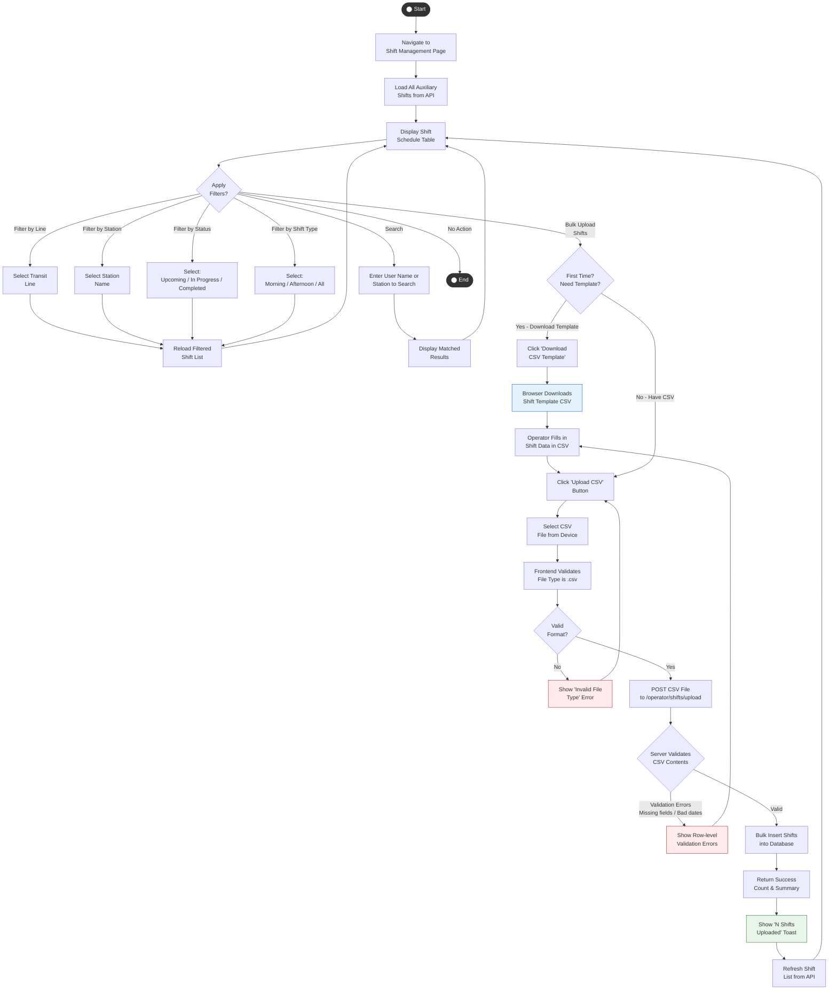

---

## 12. Auxiliary: Shift Detection & Alert Response

> **Actor:** Auxiliary Staff  
> **Trigger:** Auxiliary staff opens the app during or before their assigned shift  
> **Outcome:** Alert responded to and marked resolved; audit trail recorded

```mermaid
flowchart TD
    START(["⬤ Start: Open App"])
    START --> A[Load Auxiliary\nInterface]
    A --> B[Fetch Current\nShift from API]
    B --> C{Active Shift\nFound?}

    C -->|No Shift Today| D[Show 'No Active\nShift Assigned' Banner]
    D --> E[View Upcoming\nShift Details if Any]
    E --> END1(["⬤ End: Off Duty"])

    C -->|Upcoming — Not Yet Started| F[Show Upcoming\nShift Banner with Countdown]
    F --> G[Wait Until\nShift Start Time]
    G --> C

    C -->|Active Shift| H[Show Active Shift\nBanner: Station + Time]
    H --> I[Load Station-Filtered\nAlert List]
    I --> J{New Alert\nNotification?}
    J -->|Push Notification\nReceived| K[Tap Notification\nor Open App]
    J -->|Manual Refresh| L[Pull to Refresh\nor Auto-refresh]
    K --> M[View Alert\nin Feed]
    L --> M

    M --> N[Tap Alert to\nOpen Detail View]
    N --> O[View Alert Info:\nType / Time / Platform / Coach]
    O --> P[View Response\nTimeline & Audit Trail]
    P --> Q{Alert\nStatus?}

    Q -->|Already Resolved\nor Dismissed| R[View Audit Trail\nOnly — Read Only]
    R --> I

    Q -->|Pending or Verified\nAction Required| S{Respond\nto Alert?}
    S -->|No — Monitor| I

    S -->|Yes| T[Tap 'Mark\nEn Route' Button]
    T --> T1[Alert Status Updated\nto 'En Route']
    T1 --> T2[Audit Entry:\nEn Route By + Timestamp]
    T2 --> U[Travel to\nIncident Location\non Platform / Train]
    U --> V[Assess Situation\nOn-site]
    V --> W{Situation\nHandled?}

    W -->|Needs Emergency\nResponse| X[Contact Operator\nto Escalate]
    X --> Y[Await Emergency\nServices Arrival]
    Y --> Z[Situation Resolved\nwith Emergency Support]

    W -->|Handled by\nAuxiliary| AA[Tap 'Mark\nResolved' Button]
    Z --> AA
    AA --> AB[Enter Resolution\nComment or Note]
    AB --> AC[Submit Resolution\nto API]
    AC --> AD[Alert Status Updated\nto 'Resolved']
    AD --> AE[Audit Trail Complete:\nResolved By + Time + Comment]
    AE --> AF{More Pending\nAlerts?}
    AF -->|Yes| I
    AF -->|No| AG[View Alerts\nHistory Archive]
    AG --> AH{Shift\nEnded?}
    AH -->|No — Still On Duty| I
    AH -->|Yes| AI[Shift Status\nUpdated to Completed]
    AI --> END2(["⬤ End: Shift Complete"])

    style START fill:#333,color:#fff,stroke:#333
    style END1 fill:#546E7A,color:#fff,stroke:#37474F
    style END2 fill:#1B5E20,color:#fff,stroke:#1B5E20
    style T1 fill:#1565C0,color:#fff,stroke:#0D47A1
    style AD fill:#1B5E20,color:#fff,stroke:#155724
    style D fill:#ECEFF1,stroke:#546E7A
    style X fill:#FFEBEE,stroke:#C62828
```

---

## 13. Push Notification Subscription & Real-time Delivery

> **Actors:** Passenger, Operator, Auxiliary Staff; Push Notification Service (system)  
> **Trigger:** User enables notifications in Settings / first login; an alert event occurs  
> **Outcome:** User receives real-time push notification when alert is created or updated

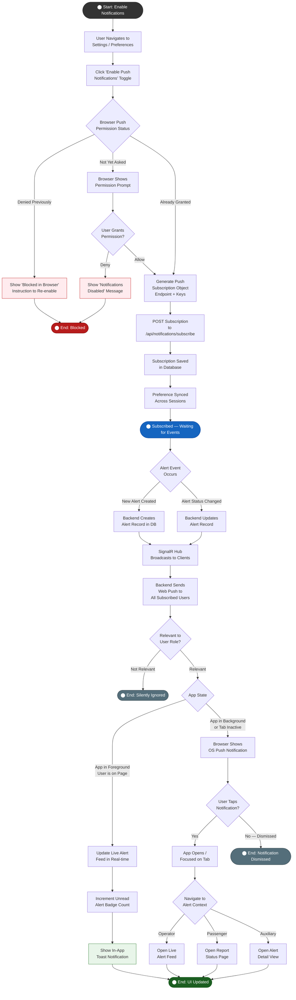

---

## 14. Offline Queue: Report Sync on Reconnection

> **Actor:** Passenger (system behavior on reconnect)  
> **Trigger:** App detects network restoration while offline reports are queued  
> **Outcome:** All queued reports flushed and submitted to the server

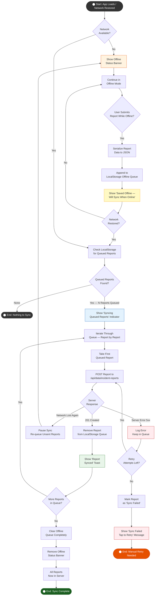

---

## Activity Diagram Summary

| # | Diagram | Primary Actor(s) | Key Decision Points |
|---|---|---|---|
| 1 | User Registration & MFA Setup | Passenger | Input validation, OTP validity, TOTP validity |
| 2 | Login with MFA | All Roles | Account status, password check, MFA method, role-based redirect |
| 3 | Password Recovery | All Roles | OTP validity, password strength, match check |
| 4 | Change Password | All Roles | Current password correct, strength rules, new ≠ current |
| 5 | Session Management & Auto-Logout | All Roles | 55-min warning, 60-min idle, 401 response |
| 6 | Submit Incident Report (Offline) | Passenger | GPS availability, station detection, online/offline, server response |
| 7 | Track Report & Request Escalation | Passenger | Report status state, escalation eligibility, real-time updates |
| 8 | Alert Management Lifecycle | Operator, Auxiliary | Alert source, validity assessment, severity, response path |
| 9 | Dashboard & Report Generation | Operator | Date filter, AI summary request, PDF export |
| 10 | User Account Management | Operator | Role/status filter, action selection, destructive confirmation |
| 11 | Shift Schedule Management | Operator | Filter type, CSV upload, server validation |
| 12 | Shift Detection & Alert Response | Auxiliary | Shift status, alert action, escalation needed |
| 13 | Push Notification Delivery | All Roles | Permission granted, app state, role relevance |
| 14 | Offline Queue Sync | Passenger (system) | Queue found, server response, retry limit |
