# Class Diagram - Services, Implementations, and Controllers

This diagram focuses on backend service interfaces, concrete service implementations, infrastructure/realtime services, and controller inheritance/dependencies. It intentionally excludes the domain ERD, database tables, and entity relationships.

```mermaid
classDiagram
    direction LR

    %% Service interfaces
    class IAlertService {
        <<interface>>
        +MapToAlertDTO(Incident, DateTime) AlertDTO
    }

    class IS3Service {
        <<interface>>
        +UploadFileAsync(IFormFile, string) Task~string~
        +UploadFileWithKeyAsync(IFormFile, string) Task~string~
        +DeleteFileAsync(string) Task~bool~
        +GeneratePresignedUrl(string, int) string
    }

    class IGeminiService {
        <<interface>>
        +GenerateAsync(string, CancellationToken) Task~string~
    }

    class IPushNotificationService {
        <<interface>>
        +NotifyNewIncident(int, string) Task
        +NotifyStatusChange(int, string) Task
        +NotifyReEscalation(int, string) Task
    }

    class ITotpService {
        <<interface>>
        +VerifyCode(string, string) bool
        +GenerateSecret() string
        +GetQrCodeUri(string, string) string
    }

    class IEmailVerificationSender {
        <<interface>>
        +SendLoginOtpAsync(string, string, string) Task~bool~
    }

    %% Service implementations
    class AlertService {
        +MapToAlertDTO(Incident, DateTime) AlertDTO
    }

    class S3Service {
        +UploadFileAsync(IFormFile, string) Task~string~
        +UploadFileWithKeyAsync(IFormFile, string) Task~string~
        +DeleteFileAsync(string) Task~bool~
        +GeneratePresignedUrl(string, int) string
    }

    class GeminiService {
        +GenerateAsync(string, CancellationToken) Task~string~
    }

    class PushNotificationService {
        +NotifyNewIncident(int, string) Task
        +NotifyStatusChange(int, string) Task
        +NotifyReEscalation(int, string) Task
    }

    class TotpService {
        +VerifyCode(string, string) bool
        +GenerateSecret() string
        +GetQrCodeUri(string, string) string
    }

    class EmailService {
        +SendLoginOtpAsync(string, string, string) Task~bool~
    }

    class PushNotificationServiceExtensions {
        <<static>>
        +SafeNotifyNewIncident(IPushNotificationService, int, string, ILogger) Task
        +SafeNotifyStatusChange(IPushNotificationService, int, string, ILogger) Task
        +SafeNotifyReEscalation(IPushNotificationService, int, string, ILogger) Task
    }

    %% Infrastructure / realtime services
    class AuthChallengeStore {
        <<singleton>>
        +Create(string, TimeSpan, string) tuple
        +GetMetadata(string) string
        +GetUserId(string) string
        +VerifyAndConsume(string, string, string) tuple
        +RemoveExpired() int
    }

    class TotpUsedCodeCache {
        <<singleton>>
        +TryMarkUsed(string, string) bool
    }

    class ChallengeCleanupService {
        <<BackgroundService>>
        #ExecuteAsync(CancellationToken) Task
    }

    class AlertHub {
        <<SignalR Hub>>
    }

    %% Interface to implementation mapping
    AlertService ..|> IAlertService
    S3Service ..|> IS3Service
    GeminiService ..|> IGeminiService
    PushNotificationService ..|> IPushNotificationService
    TotpService ..|> ITotpService
    EmailService ..|> IEmailVerificationSender

    %% Service dependencies
    AlertService --> IS3Service : presigns image URLs
    TotpService --> TotpUsedCodeCache : rejects replayed codes
    ChallengeCleanupService --> AuthChallengeStore : removes expired challenges
    PushNotificationServiceExtensions ..> IPushNotificationService : safe notify wrappers

    %% Controller base hierarchy
    class ControllerBase {
        <<ASP.NET Core>>
    }

    class BaseApiController {
        <<abstract>>
        #GetCurrentUserId() string
    }

    ControllerBase <|-- BaseApiController

    %% Controllers
    class AuthController {
        <<ApiController>>
        +CheckAccount()
        +Login()
        +StartOtpLogin()
        +VerifyLogin()
        +MfaSetup()
        +MfaActivate()
        +SetupPassword()
        +ChangePasswordStart()
        +ChangePassword()
        +SignupStart()
        +SignupComplete()
        +ForgotPasswordStart()
        +ForgotPasswordReset()
        +Me()
        +Logout()
    }

    class AuxiliaryController {
        <<ApiController>>
        +GetAuxiliaryShift()
        +GetAuxiliaryUsers()
        +GetStations()
        +GetAlertsByStation()
        +UpdateAlertStatus()
        +GetHistoryByUser()
    }

    class DetectionController {
        <<ApiController>>
        +NotifyNewDetection()
    }

    class GeoController {
        <<ApiController>>
        +Preview()
        +GeocodeStations()
        +GetNearbyStations()
    }

    class NotificationController {
        <<ApiController>>
        +Subscribe()
        +Unsubscribe()
    }

    class OperatorController {
        <<ApiController>>
        +GetReportSummary()
        +GetHomeStats()
        +IncidentAlerts()
        +UpdateAlertStatus()
        +GetOperatorDashboard()
        +GetOperatorAlerts()
        +GetOperatorReports()
        +GetAllUsers()
        +UpdateUserStatus()
        +GetAuxiliaryShiftAssignments()
        +ImportShifts()
        +ImportUsers()
        +GetOperatorSettings()
        +SaveOperatorSettings()
    }

    class PassengerController {
        <<ApiController>>
        +GetLines()
        +SubmitReport()
        +UploadReportImage()
        +GetProfile()
        +GetIncidentNearMe()
        +GetMyHistory()
        +UpdateIncidentStatus()
        +GetStationsByLine()
        +GetTravelAdvice()
    }

    %% Controller inheritance
    BaseApiController <|-- AuthController
    BaseApiController <|-- AuxiliaryController
    BaseApiController <|-- DetectionController
    BaseApiController <|-- GeoController
    BaseApiController <|-- NotificationController
    BaseApiController <|-- OperatorController
    BaseApiController <|-- PassengerController

    %% Controller to service/infrastructure dependencies
    AuthController --> AuthChallengeStore
    AuthController --> ITotpService
    AuthController --> IEmailVerificationSender

    AuxiliaryController --> IAlertService
    AuxiliaryController --> IPushNotificationService
    AuxiliaryController --> AlertHub : IHubContext

    DetectionController --> IPushNotificationService
    DetectionController --> AlertHub : IHubContext

    OperatorController --> IAlertService
    OperatorController --> IS3Service
    OperatorController --> IGeminiService
    OperatorController --> IPushNotificationService
    OperatorController --> AlertHub : IHubContext

    PassengerController --> IAlertService
    PassengerController --> IS3Service
    PassengerController --> IGeminiService
    PassengerController --> IPushNotificationService
    PassengerController --> AlertHub : IHubContext
```

