# Class Diagram - Services, Implementations, and Controllers

This diagram focuses on backend service interfaces, concrete service implementations, infrastructure/realtime services, and controller inheritance/dependencies. It intentionally excludes the domain ERD, database tables, and entity relationships.

```mermaid
classDiagram
    direction LR

    %% Service interfaces
    class IAlertService {
        <<interface>>
        +MapToAlertDTO(Incident, DateTime) AlertDTO
    }

    class IS3Service {
        <<interface>>
        +UploadFileAsync(IFormFile, string) Task~string~
        +UploadFileWithKeyAsync(IFormFile, string) Task~string~
        +DeleteFileAsync(string) Task~bool~
        +GeneratePresignedUrl(string, int) string
    }

    class IGeminiService {
        <<interface>>
        +GenerateAsync(string, CancellationToken) Task~string~
    }

    class IPushNotificationService {
        <<interface>>
        +NotifyNewIncident(int, string) Task
        +NotifyStatusChange(int, string) Task
        +NotifyReEscalation(int, string) Task
    }

    class ITotpService {
        <<interface>>
        +VerifyCode(string, string) bool
        +GenerateSecret() string
        +GetQrCodeUri(string, string) string
    }

    class IEmailVerificationSender {
        <<interface>>
        +SendLoginOtpAsync(string, string, string) Task~bool~
    }

    %% Service implementations
    class AlertService {
        +MapToAlertDTO(Incident, DateTime) AlertDTO
    }

    class S3Service {
        +UploadFileAsync(IFormFile, string) Task~string~
        +UploadFileWithKeyAsync(IFormFile, string) Task~string~
        +DeleteFileAsync(string) Task~bool~
        +GeneratePresignedUrl(string, int) string
    }

    class GeminiService {
        +GenerateAsync(string, CancellationToken) Task~string~
    }

    class PushNotificationService {
        +NotifyNewIncident(int, string) Task
        +NotifyStatusChange(int, string) Task
        +NotifyReEscalation(int, string) Task
    }

    class TotpService {
        +VerifyCode(string, string) bool
        +GenerateSecret() string
        +GetQrCodeUri(string, string) string
    }

    class EmailService {
        +SendLoginOtpAsync(string, string, string) Task~bool~
    }

    class PushNotificationServiceExtensions {
        <<static>>
        +SafeNotifyNewIncident(IPushNotificationService, int, string, ILogger) Task
        +SafeNotifyStatusChange(IPushNotificationService, int, string, ILogger) Task
        +SafeNotifyReEscalation(IPushNotificationService, int, string, ILogger) Task
    }

    %% Infrastructure / realtime services
    class AuthChallengeStore {
        <<singleton>>
        +Create(string, TimeSpan, string) tuple
        +GetMetadata(string) string
        +GetUserId(string) string
        +VerifyAndConsume(string, string, string) tuple
        +RemoveExpired() int
    }

    class TotpUsedCodeCache {
        <<singleton>>
        +TryMarkUsed(string, string) bool
    }

    class ChallengeCleanupService {
        <<BackgroundService>>
        #ExecuteAsync(CancellationToken) Task
    }

    class AlertHub {
        <<SignalR Hub>>
    }

    %% Interface to implementation mapping
    AlertService ..|> IAlertService
    S3Service ..|> IS3Service
    GeminiService ..|> IGeminiService
    PushNotificationService ..|> IPushNotificationService
    TotpService ..|> ITotpService
    EmailService ..|> IEmailVerificationSender

    %% Service dependencies
    AlertService --> IS3Service : presigns image URLs
    TotpService --> TotpUsedCodeCache : rejects replayed codes
    ChallengeCleanupService --> AuthChallengeStore : removes expired challenges
    PushNotificationServiceExtensions ..> IPushNotificationService : safe notify wrappers

    %% Controller base hierarchy
    class ControllerBase {
        <<ASP.NET Core>>
    }

    class BaseApiController {
        <<abstract>>
        #GetCurrentUserId() string
    }

    ControllerBase <|-- BaseApiController

    %% Controllers
    class AuthController {
        <<ApiController>>
        +CheckAccount()
        +Login()
        +StartOtpLogin()
        +VerifyLogin()
        +MfaSetup()
        +MfaActivate()
        +SetupPassword()
        +ChangePasswordStart()
        +ChangePassword()
        +SignupStart()
        +SignupComplete()
        +ForgotPasswordStart()
        +ForgotPasswordReset()
        +Me()
        +Logout()
    }

    class AuxiliaryController {
        <<ApiController>>
        +GetAuxiliaryShift()
        +GetAuxiliaryUsers()
        +GetStations()
        +GetAlertsByStation()
        +UpdateAlertStatus()
        +GetHistoryByUser()
    }

    class DetectionController {
        <<ApiController>>
        +NotifyNewDetection()
    }

    class GeoController {
        <<ApiController>>
        +Preview()
        +GeocodeStations()
        +GetNearbyStations()
    }

    class NotificationController {
        <<ApiController>>
        +Subscribe()
        +Unsubscribe()
    }

    class OperatorController {
        <<ApiController>>
        +GetReportSummary()
        +GetHomeStats()
        +UpdateAlertStatus()
        +GetOperatorDashboard()
        +GetOperatorAlerts()
        +GetOperatorReports()
        +GetAllUsers()
        +UpdateUserStatus()
        +GetAuxiliaryShiftAssignments()
        +ImportShifts()
        +ImportUsers()
        +GetOperatorSettings()
        +SaveOperatorSettings()
    }

    class PassengerController {
        <<ApiController>>
        +GetLines()
        +SubmitReport()
        +UploadReportImage()
        +GetIncidentNearMe()
        +GetMyHistory()
        +UpdateIncidentStatus()
        +GetStationsByLine()
        +GetTravelAdvice()
    }

    class SharedController {
        <<ApiController>>
        +IncidentAlerts()
        +GetProfile()
    }

    %% Controller inheritance
    BaseApiController <|-- AuthController
    BaseApiController <|-- AuxiliaryController
    BaseApiController <|-- DetectionController
    BaseApiController <|-- GeoController
    BaseApiController <|-- NotificationController
    BaseApiController <|-- OperatorController
    BaseApiController <|-- PassengerController
    BaseApiController <|-- SharedController

    %% Controller to service/infrastructure dependencies
    AuthController --> AuthChallengeStore
    AuthController --> ITotpService
    AuthController --> IEmailVerificationSender

    AuxiliaryController --> IAlertService
    AuxiliaryController --> IPushNotificationService
    AuxiliaryController --> AlertHub : IHubContext

    DetectionController --> IPushNotificationService
    DetectionController --> AlertHub : IHubContext

    OperatorController --> IAlertService
    OperatorController --> IS3Service
    OperatorController --> IGeminiService
    OperatorController --> IPushNotificationService
    OperatorController --> AlertHub : IHubContext

    PassengerController --> IAlertService
    PassengerController --> IS3Service
    PassengerController --> IGeminiService
    PassengerController --> IPushNotificationService
    PassengerController --> AlertHub : IHubContext

    SharedController --> IAlertService
```

---

## Section Breakdown

### 1. Service Interfaces

Six interfaces define the contracts that the rest of the system programs against. Controllers and other services depend on these interfaces, never on the concrete classes, which keeps each layer independently testable and swappable.

| Interface | Purpose |
|---|---|
| `IAlertService` | Converts a raw `Incident` entity into a serialisable `AlertDTO` for API responses. |
| `IS3Service` | Abstracts all AWS S3 file operations — upload, delete, and generating time-limited pre-signed URLs for serving images. |
| `IGeminiService` | Single-method interface for sending a prompt to Google Gemini and returning the generated text. Used for AI report summaries and passenger travel tips. |
| `IPushNotificationService` | Sends browser Web Push notifications for three distinct events: new incident creation, status change, and re-escalation. |
| `ITotpService` | Handles Google Authenticator TOTP — generating secrets, building QR code URIs, and verifying submitted codes. |
| `IEmailVerificationSender` | Sends OTP codes via email for signup verification, login second factor, and password reset flows. |

---

### 2. Service Implementations

Each interface has exactly one concrete implementation registered in `Program.cs` via dependency injection. The implementations contain all the third-party SDK calls (AWS, Google, SMTP) so that detail never leaks into controllers.

| Implementation | Key Detail |
|---|---|
| `AlertService` | Maps `Incident` entities with all their navigations (line, station, train, coach, status timestamps) into a flat `AlertDTO`. Internally calls `IS3Service.GeneratePresignedUrl` to attach a short-lived image URL to each DTO. |
| `S3Service` | Wraps the AWS SDK `AmazonS3Client`. Derives S3 keys from file type, uploads streams, and generates pre-signed GET URLs. |
| `GeminiService` | Wraps the Vertex AI Gemini REST API. Takes a plain prompt string and returns the generated text response. |
| `PushNotificationService` | Uses the VAPID Web Push protocol to send push payloads to all subscribed browser endpoints stored in the database. |
| `TotpService` | Uses an OTP library to verify 6-digit TOTP codes against a stored secret. Delegates to `TotpUsedCodeCache` to reject replayed codes within the same 30-second window. |
| `EmailService` | Sends OTP emails via Amazon SES SMTP. Formats the message with the user's name and a 6-digit code. |
| `PushNotificationServiceExtensions` | A static helper class that wraps the three notify methods with try/catch and logging so that a push failure never propagates as an unhandled exception into a controller action. All controllers call these safe wrappers rather than the raw interface methods. |

---

### 3. Infrastructure & Real-time Services

These are supporting services that manage short-lived state and real-time communication. They are not directly called by external clients but are critical to the authentication and alerting flows.

| Class | Lifetime | Purpose |
|---|---|---|
| `AuthChallengeStore` | Singleton | In-memory store for time-limited OTP challenges. Each challenge holds a user ID, expiry time, and optional metadata (e.g. a pending password hash). `VerifyAndConsume` atomically validates and deletes the challenge so it cannot be reused. |
| `TotpUsedCodeCache` | Singleton | Tracks recently verified TOTP codes per secret to prevent replay attacks within the same 30-second TOTP window. |
| `ChallengeCleanupService` | Background service | Runs on a timer and calls `AuthChallengeStore.RemoveExpired()` to evict stale challenges from memory, preventing unbounded growth. |
| `AlertHub` | SignalR Hub | The real-time WebSocket hub. Operators, passengers, and auxiliary staff connect to it on login. When an incident is created or its status changes, controllers broadcast through this hub so all connected clients update instantly without polling. |

---

### 4. Controller Base Hierarchy

All controllers extend `BaseApiController`, which itself extends ASP.NET Core's `ControllerBase`.

**`BaseApiController`** provides two shared utilities used across every controller:
- `GetCurrentUserId()` — reads the `sub` claim from the JWT in the HttpOnly cookie and returns the authenticated user's ID. Falls back to `ClaimTypes.NameIdentifier` to handle ASP.NET Core's automatic claim mapping.
- `RequireUserId()` — convenience wrapper that returns the user ID or a ready-made `401 Unauthorized` result, eliminating repeated null-check boilerplate in action methods.

It also exposes `MytNow` and `MytTodayUtc` — helpers that convert UTC time to Malaysian Time (UTC+8) for date-range filtering, since all shift and incident timestamps are stored in MYT.

---

### 5. Controllers

Each controller handles a distinct domain slice. All are decorated with `[ApiController]` and `[Route("api/data")]` (or `[Route("api/auth")]` for `AuthController`), and all inherit the JWT claim helpers from `BaseApiController`.

**`AuthController`** — handles the full authentication lifecycle. Login is split into a password step and a separate MFA verification step. Operators verify with Google Authenticator TOTP; auxiliary staff and passengers use email OTP. On successful verification it calls `GenerateJwtToken` internally and sets the result as an HttpOnly cookie via `SetAuthCookie`. It is the only controller that writes to the cookie.

**`AuxiliaryController`** — restricted to the `auxiliary` role at the class level (`[Authorize(Roles = "auxiliary")]`). Serves the station-filtered alert feed (incidents within ±2 stations of the officer's assigned shift station), shift lookup, and alert status updates (en route / resolved).

**`DetectionController`** — receives inbound webhook calls from the AI camera system when a new detection occurs. Creates the incident record and fires the SignalR broadcast and push notification. Not called by any frontend directly.

**`GeoController`** — provides geolocation utilities: geocoding station addresses and finding nearby stations given GPS coordinates. Used by the passenger app to auto-fill line and station fields when submitting a report.

**`NotificationController`** — manages Web Push subscriptions. Passengers, operators, and auxiliary staff call `Subscribe` to register their browser's push endpoint; `Unsubscribe` removes it. Subscription objects are persisted to the database so push notifications survive server restarts.

**`OperatorController`** — restricted to the `operator` role on most endpoints. Covers the full operator workflow: live alert management (verify, dismiss, escalate, en route, resolve), the KPI dashboard, monthly analytics reports, user account management (suspend, reactivate, archive), shift schedule management (view, bulk CSV import), and operator notification preferences.

**`PassengerController`** — handles the passenger-facing API. Report submission and photo upload are restricted to the `passenger` role. `GetIncidentNearMe` and `GetLines`/`GetStationsByLine` are public (no auth required) since they expose read-only safety data. `GetMyHistory`, `UpdateIncidentStatus`, and `GetTravelAdvice` are passenger-only.

**`SharedController`** — owns the two endpoints accessed by more than one role. `IncidentAlerts` (`GET /api/data/incident-alerts`) is open to `operator` and `passenger` — the operator uses it for the live alert feed context, and the passenger Insights page uses it to render safety analytics charts. `GetProfile` (`GET /api/data/profile`) is open to `passenger` and `auxiliary` — the same endpoint returns either a `PassengerProfileDto` or `AuxiliaryProfileDto` based on the authenticated user's role, so duplicating it was unnecessary.

---

### 6. Controller → Service Dependencies

The dependency graph shows which services each controller injects via constructor. Key observations:

- `AuthController` is the only controller that touches `AuthChallengeStore`, `ITotpService`, and `IEmailVerificationSender` — all authentication-specific infrastructure stays isolated here.
- `OperatorController` and `PassengerController` both inject the full set of action services (`IAlertService`, `IS3Service`, `IGeminiService`, `IPushNotificationService`, `AlertHub`) because they handle the heaviest workflows — incident creation, image upload, AI generation, and push notifications.
- `SharedController` only needs `IAlertService` — its two endpoints read and map incident data but do not upload files, call AI, or send notifications.
- `AuxiliaryController` and `DetectionController` omit `IS3Service` and `IGeminiService` because auxiliary staff never upload files and the detection webhook doesn't call AI.
- `AlertHub` is injected as `IHubContext<AlertHub>` rather than directly — this is ASP.NET Core's pattern for broadcasting from outside the hub itself.
