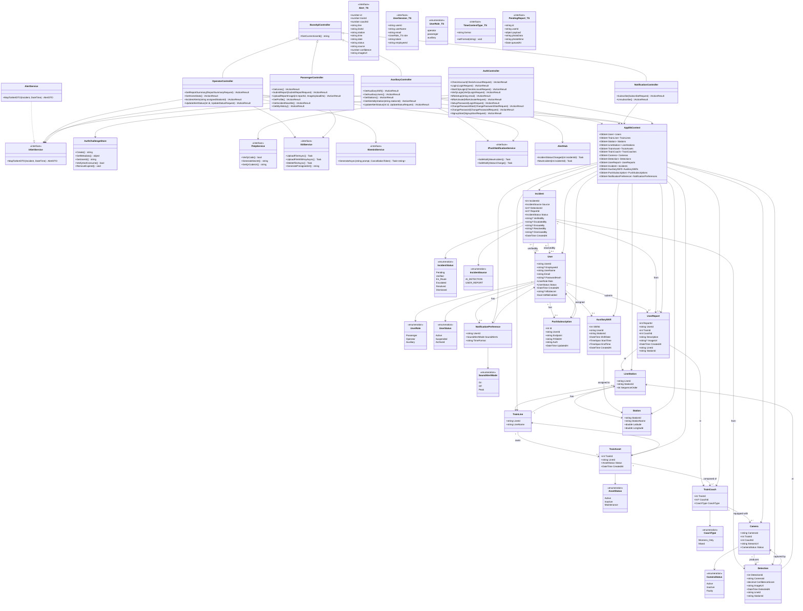

# Class Diagram — FYP TP076823

Paste the Mermaid block below into [https://mermaid.live](https://mermaid.live) to render.

```mermaid
classDiagram
    %% ─────────────────────────────────────────
    %% ENUMERATIONS
    %% ─────────────────────────────────────────
    class UserRole {
        <<enumeration>>
        Passenger
        Operator
        Auxiliary
    }
    class UserStatus {
        <<enumeration>>
        Active
        Suspended
        Archived
    }
    class IncidentStatus {
        <<enumeration>>
        Pending
        Verified
        En_Route
        Escalated
        Resolved
        Dismissed
    }
    class IncidentSource {
        <<enumeration>>
        AI_DETECTION
        USER_REPORT
    }
    class AssetStatus {
        <<enumeration>>
        Active
        Inactive
        Maintenance
    }
    class CoachType {
        <<enumeration>>
        Womens_Only
        Mixed
    }
    class CameraStatus {
        <<enumeration>>
        Active
        Inactive
        Faulty
    }
    class SoundAlertMode {
        <<enumeration>>
        On
        Off
        Peak
    }

    %% ─────────────────────────────────────────
    %% DOMAIN ENTITIES
    %% ─────────────────────────────────────────
    class User {
        +string UserId
        +string? EmployeeId
        +string UserName
        +string Email
        +string? PasswordHash
        +UserRole Role
        +UserStatus Status
        +DateTime CreatedAt
        +string? MfaSecret
        +bool IsMfaEnabled
    }
    class Incident {
        +int IncidentId
        +IncidentSource Source
        +int? DetectionId
        +int? ReportId
        +IncidentStatus Status
        +string? VerifiedBy
        +string? EscalatedBy
        +string? EnrouteBy
        +string? ResolvedBy
        +string? DismissedBy
        +DateTime CreatedAt
    }
    class UserReport {
        +int ReportId
        +string UserId
        +int TrainId
        +int CoachId
        +string Description
        +string? ImageUrl
        +DateTime CreatedAt
        +string LineId
        +string StationId
    }
    class Detection {
        +int DetectionId
        +string CameraId
        +decimal ConfidenceScore
        +string ImageUrl
        +DateTime DetectedAt
        +string LineId
        +string StationId
    }
    class TrainLine {
        +string LineId
        +string LineName
    }
    class TrainAsset {
        +int TrainId
        +string LineId
        +AssetStatus Status
        +DateTime CreatedAt
    }
    class TrainCoach {
        +int TrainId
        +int? CoachId
        +CoachType CoachType
    }
    class Camera {
        +string CameraId
        +int TrainId
        +int CoachId
        +string StreamUrl
        +CameraStatus Status
    }
    class Station {
        +string StationId
        +string StationName
        +double Latitude
        +double Longitude
    }
    class LineStation {
        +string LineId
        +string StationId
        +int SequenceOrder
    }
    class AuxiliaryShift {
        +int ShiftId
        +string UserId
        +string StationId
        +DateTime ShiftDate
        +TimeSpan StartTime
        +TimeSpan EndTime
        +DateTime CreatedAt
    }
    class PushSubscription {
        +int Id
        +string UserId
        +string Endpoint
        +string P256DH
        +string Auth
        +DateTime UpdatedAt
    }
    class NotificationPreference {
        +string UserId
        +SoundAlertMode SoundAlerts
        +string TimeFormat
    }

    %% ─────────────────────────────────────────
    %% SERVICES (interfaces + implementations)
    %% ─────────────────────────────────────────
    class IAlertService {
        <<interface>>
        +MapToAlertDTO(Incident, DateTime) AlertDTO
    }
    class AlertService {
        +MapToAlertDTO(Incident, DateTime) AlertDTO
    }
    class AuthChallengeStore {
        +Create() string
        +GetMetadata() object
        +GetUserId() string
        +VerifyAndConsume() bool
        +RemoveExpired() void
    }
    class ITotpService {
        <<interface>>
        +VerifyCode() bool
        +GenerateSecret() string
        +GetQrCodeUri() string
    }
    class IS3Service {
        <<interface>>
        +UploadFileAsync() Task
        +UploadFileWithKeyAsync() Task
        +DeleteFileAsync() Task
        +GeneratePresignedUrl() string
    }
    class IGeminiService {
        <<interface>>
        +GenerateAsync(string prompt, CancellationToken) Task~string~
    }
    class IPushNotificationService {
        <<interface>>
        +SafeNotifyNewIncident() Task
        +SafeNotifyStatusChange() Task
    }

    %% ─────────────────────────────────────────
    %% CONTROLLERS
    %% ─────────────────────────────────────────
    class BaseApiController {
        #GetCurrentUserId() string
    }
    class AuthController {
        +CheckAccount(CheckAccountRequest) IActionResult
        +Login(LoginRequest) IActionResult
        +StartOtpLogin(CheckAccountRequest) IActionResult
        +VerifyLogin(VerifyLoginRequest) IActionResult
        +MfaSetup(string email) IActionResult
        +MfaActivate(MfaActivateRequest) IActionResult
        +SetupPassword(LoginRequest) IActionResult
        +ChangePasswordStart(ChangePasswordStartRequest) IActionResult
        +ChangePassword(ChangePasswordRequest) IActionResult
        +SignupStart(SignupStartRequest) IActionResult
    }
    class AuxiliaryController {
        +GetAuxiliaryShift() IActionResult
        +GetAuxiliaryUsers() IActionResult
        +GetStations() IActionResult
        +GetAlertsByStation(string stationId) IActionResult
        +UpdateAlertStatus(int id, UpdateStatusRequest) IActionResult
    }
    class OperatorController {
        +GetReportSummary(ReportSummaryRequest) IActionResult
        +GetHomeStats() IActionResult
        +IncidentAlerts(string assignedStationId) IActionResult
        +UpdateAlertStatus(int id, UpdateStatusRequest) IActionResult
    }
    class PassengerController {
        +GetLines() IActionResult
        +SubmitReport(SubmitReportRequest) IActionResult
        +UploadReportImage(int reportId, ImageUploadDto) IActionResult
        +GetProfile() IActionResult
        +GetIncidentNearMe() IActionResult
        +GetMyHistory() IActionResult
    }
    class NotificationController {
        +Subscribe(SubscribeRequest) IActionResult
        +Unsubscribe() IActionResult
    }

    %% ─────────────────────────────────────────
    %% SIGNALR HUB
    %% ─────────────────────────────────────────
    class AlertHub {
        +IncidentStatusChanged(int incidentId) Task
        +NewIncident(int incidentId) Task
    }

    %% ─────────────────────────────────────────
    %% DATA LAYER
    %% ─────────────────────────────────────────
    class AppDbContext {
        +DbSet~User~ Users
        +DbSet~TrainLine~ TrainLines
        +DbSet~Station~ Stations
        +DbSet~LineStation~ LineStations
        +DbSet~TrainAsset~ TrainAssets
        +DbSet~TrainCoach~ TrainCoaches
        +DbSet~Camera~ Cameras
        +DbSet~Detection~ Detections
        +DbSet~UserReport~ UserReports
        +DbSet~Incident~ Incidents
        +DbSet~AuxiliaryShift~ AuxiliaryShifts
        +DbSet~PushSubscription~ PushSubscriptions
        +DbSet~NotificationPreference~ NotificationPreferences
    }

    %% ─────────────────────────────────────────
    %% FRONTEND TYPES / INTERFACES
    %% ─────────────────────────────────────────
    class Alert_TS {
        <<interface>>
        +number id
        +number trainId
        +number coachId
        +string line
        +string lineId
        +string station
        +string time
        +string date
        +string status
        +string source
        +number confidence
        +string imageUrl
    }
    class UserSession_TS {
        <<interface>>
        +string userId
        +string userName
        +string email
        +UserRole_TS role
        +string token
        +string employeeId
    }
    class UserRole_TS {
        <<enumeration>>
        operator
        passenger
        auxiliary
    }
    class TimeContextType_TS {
        <<interface>>
        +string format
        +setFormat(string) void
    }
    class PendingReport_TS {
        <<interface>>
        +string id
        +string userId
        +object payload
        +string photoData
        +string photoMime
        +Date queuedAt
    }

    %% ─────────────────────────────────────────
    %% DOMAIN ENTITY RELATIONSHIPS
    %% ─────────────────────────────────────────
    User "1" --> "0..*" UserReport : submits
    User "1" --> "0..1" AuxiliaryShift : assigned
    User "1" --> "0..1" PushSubscription : has
    User "1" --> "0..1" NotificationPreference : has
    User --> UserRole
    User --> UserStatus

    Incident --> IncidentSource
    Incident --> IncidentStatus
    Incident "1" --> "0..1" UserReport : from
    Incident "1" --> "0..1" Detection : from
    Incident "0..*" --> "0..1" User : verifiedBy
    Incident "0..*" --> "0..1" User : resolvedBy

    UserReport --> LineStation : at
    UserReport --> TrainCoach : in

    Detection --> Camera : captured by
    Detection --> LineStation : at

    TrainLine "1" --> "1..*" LineStation : has
    TrainLine "1" --> "1..*" TrainAsset : owns

    TrainAsset --> AssetStatus
    TrainAsset --> TrainLine
    TrainAsset "1" --> "1..*" TrainCoach : composed of

    TrainCoach --> CoachType
    TrainCoach "1" --> "0..*" Camera : equipped with

    Camera --> CameraStatus
    Camera "1" --> "0..*" Detection : produces

    LineStation --> Station
    LineStation --> TrainLine

    AuxiliaryShift --> Station : assigned to

    PushSubscription --> User
    NotificationPreference --> User
    NotificationPreference --> SoundAlertMode

    %% ─────────────────────────────────────────
    %% SERVICE IMPLEMENTATION RELATIONSHIPS
    %% ─────────────────────────────────────────
    AlertService ..|> IAlertService

    %% ─────────────────────────────────────────
    %% CONTROLLER INHERITANCE & DEPENDENCIES
    %% ─────────────────────────────────────────
    BaseApiController <|-- AuxiliaryController
    BaseApiController <|-- OperatorController
    BaseApiController <|-- PassengerController
    BaseApiController <|-- NotificationController

    AuxiliaryController --> IAlertService
    AuxiliaryController --> IPushNotificationService
    AuxiliaryController --> AlertHub
    AuxiliaryController --> AppDbContext

    OperatorController --> IAlertService
    OperatorController --> IS3Service
    OperatorController --> IGeminiService
    OperatorController --> IPushNotificationService
    OperatorController --> AppDbContext

    PassengerController --> IAlertService
    PassengerController --> IS3Service
    PassengerController --> AppDbContext

    NotificationController --> AppDbContext

    AuthController --> AuthChallengeStore
    AuthController --> ITotpService
    AuthController --> AppDbContext

    AppDbContext --> User
    AppDbContext --> Incident
    AppDbContext --> UserReport
    AppDbContext --> Detection
    AppDbContext --> TrainLine
    AppDbContext --> TrainAsset
    AppDbContext --> TrainCoach
    AppDbContext --> Camera
    AppDbContext --> Station
    AppDbContext --> LineStation
    AppDbContext --> AuxiliaryShift
    AppDbContext --> PushSubscription
    AppDbContext --> NotificationPreference
```
