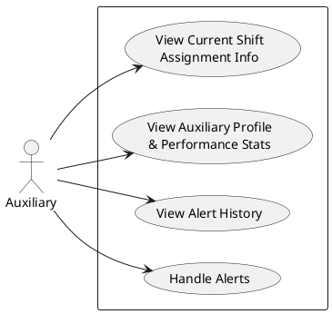

# Use Case Descriptions — Auxiliary Staff

These use case descriptions correspond to the Auxiliary actor use case diagram.

---

## UC11 — View Current Shift Assignment Info

| Field | Description |
|---|---|
| **Use Case Name** | View Current Shift Assignment Info |
| **Primary Actor** | Auxiliary Staff |
| **Goal** | Allow auxiliary staff to see their assigned station, shift date, and on-duty time window for the current day |
| **Preconditions** | Auxiliary staff is logged in; a shift has been assigned by the operator via CSV import |
| **Trigger** | Auxiliary staff opens the Shift tab in the mobile app |
| **Main Flow** | 1. Auxiliary staff opens the app and navigates to the Shift tab. 2. System fetches today's shifts for the authenticated user. 3. System identifies the currently active shift based on current MYT time. 4. System displays the assigned station name, shift start/end time, and on-duty status banner. |
| **Alternative Flow** | If no shift is assigned for today, system checks for the next upcoming shift and displays it as a preview. If no upcoming shift exists, system shows the most recently completed shift. If no shift record exists at all, system displays "No Active Shift Assigned". |
| **Postcondition** | Auxiliary staff knows their assigned station and whether they are currently on duty. |

---

## UC12 — View Auxiliary Profile & Performance Stats

| Field | Description |
|---|---|
| **Use Case Name** | View Auxiliary Profile & Performance Stats |
| **Primary Actor** | Auxiliary Staff |
| **Goal** | Allow auxiliary staff to view their account information and personal performance metrics |
| **Preconditions** | Auxiliary staff is logged in |
| **Trigger** | Auxiliary staff opens the Profile tab in the mobile app |
| **Main Flow** | 1. Auxiliary staff navigates to the Profile tab. 2. System fetches the authenticated user's profile from the database. 3. System calculates average reaction time (time between incident creation and marking en route) across all handled incidents. 4. System counts total incidents resolved by this user. 5. System displays name, email, average reaction time, and resolved count. |
| **Alternative Flow** | If the auxiliary staff has not handled any incidents yet, average reaction time displays as 0 and resolved count displays as 0. |
| **Postcondition** | Auxiliary staff can see their personal performance data and account details. |

---

## UC13 — View Alert History

| Field | Description |
|---|---|
| **Use Case Name** | View Alert History |
| **Primary Actor** | Auxiliary Staff |
| **Goal** | Allow auxiliary staff to review past incidents they were involved in handling |
| **Preconditions** | Auxiliary staff is logged in; at least one incident has been previously handled by this user |
| **Trigger** | Auxiliary staff navigates to the History tab in the mobile app |
| **Main Flow** | 1. Auxiliary staff opens the History tab. 2. System queries all incidents where the authenticated user appears as en route, resolved, escalated, or dismissed. 3. System filters to only show incidents with a terminal status (Resolved, Escalated, or Dismissed). 4. System returns the list ordered by most recent. 5. Auxiliary staff can tap any entry to view the full alert detail and action timeline. |
| **Alternative Flow** | If no historical records exist for this user, system displays an empty state message. Auxiliary staff may search or filter by date to narrow results. |
| **Postcondition** | Auxiliary staff has a complete record of past incidents they responded to, including all audit trail entries. |

---

## UC14 — Handle Alerts

| Field | Description |
|---|---|
| **Use Case Name** | Handle Alerts |
| **Primary Actor** | Auxiliary Staff |
| **Goal** | Allow auxiliary staff to respond to active incidents at their assigned station by updating alert status in real time |
| **Preconditions** | Auxiliary staff is logged in and currently on duty; an active incident exists at or near the assigned station; the incident has been verified by the operator |
| **Trigger** | A new alert appears in the station feed, or auxiliary staff receives a push notification for an incident at their station |
| **Main Flow** | 1. Auxiliary staff receives a push notification or sees a new alert in the Recent Alerts tab. 2. System displays alerts filtered to within ±2 stations of the assigned station. 3. Auxiliary staff taps the alert to open the detail view. 4. Auxiliary staff reviews the incident type, location, coach, and audit trail. 5. Auxiliary staff taps "Mark En Route" to indicate they are responding. 6. System updates the incident status to En Route and records the timestamp and user ID. 7. System broadcasts the status change via SignalR to all connected clients. 8. Auxiliary staff arrives at the location and assesses the situation. 9. Auxiliary staff taps "Mark Resolved" and enters a resolution comment. 10. System updates the incident status to Resolved and records the timestamp, user ID, and comment. 11. System sends a push notification to the reporting passenger informing them the incident is resolved. |
| **Alternative Flow** | If the situation requires emergency services, auxiliary staff informs the operator verbally to escalate. If the incident is already resolved or dismissed by the operator before the auxiliary acts, the detail view shows a read-only audit trail with no action buttons available. |
| **Postcondition** | The incident is marked Resolved with a full audit trail. The reporting passenger is notified. The incident appears in the auxiliary staff's alert history. |
