```plantuml
@startuml Railly_Use_Case_Diagram

left to right direction

skinparam packageStyle rectangle
skinparam actorStyle awesome
skinparam usecase {
  BackgroundColor #FFFDE7
  BorderColor #E65100
  FontSize 11
}
skinparam actor {
  BackgroundColor #E8F5E9
  BorderColor #2E7D32
  FontSize 12
  FontStyle bold
}
skinparam rectangle {
  BackgroundColor #EEF4FF
  BorderColor #3F51B5
  FontStyle bold
  FontSize 13
}
skinparam arrow {
  Color #444444
  FontSize 10
}
skinparam shadowing false

title <size:18><b>Railly — Transit Safety Management System</b></size>\n<size:13>Comprehensive Use Case Diagram</size>

' ==========================================
' ACTORS — Primary Users (Left Side)
' ==========================================
actor "Passenger" as P
actor "Operator" as O
actor "Auxiliary Staff\n(Station Personnel)" as A

' ==========================================
' ACTORS — External / System (Right Side)
' ==========================================
actor "AI Detection\nSystem" as AI #PaleGreen
actor "Email Service\n(OTP Delivery)" as ES #PaleGreen
actor "Push Notification\nService" as PNS #PaleGreen
actor "Emergency\nServices" as EMG #LightSalmon

' ==========================================
' 1. AUTHENTICATION & ACCOUNT MANAGEMENT
' ==========================================
rectangle "Authentication & Account Management" as AUTH {
  usecase "Register Account\n(Passenger Only)" as UC_REG
  usecase "Verify Email OTP\n(Registration)" as UC_EMAIL_OTP
  usecase "Setup MFA via\nGoogle Authenticator" as UC_MFA_SETUP
  usecase "Scan QR Code for\nTOTP Configuration" as UC_QR_SCAN
  usecase "Login with Email\n& Password" as UC_LOGIN
  usecase "Verify MFA Code\n(TOTP or Email OTP)" as UC_MFA_VERIFY
  usecase "Recover Forgotten\nPassword" as UC_FORGOT
  usecase "Verify Password\nReset OTP" as UC_RESET_OTP
  usecase "Set New Password\n(Reset Flow)" as UC_RESET_PWD
  usecase "Change Password\n(Authenticated User)" as UC_CHANGE_PWD
  usecase "Logout" as UC_LOGOUT
  usecase "Auto-Logout on\nInactivity (60 min)" as UC_AUTO_LOGOUT
  usecase "Session Expiry\nWarning (55 min idle)" as UC_SESSION_WARN
}

' ==========================================
' 2. PASSENGER: INCIDENT REPORTING
' ==========================================
rectangle "Passenger: Incident Reporting" as INC_REPORT {
  usecase "Submit Incident\nReport" as UC_REPORT
  usecase "Auto-Detect Nearby\nStations via GPS" as UC_GEO
  usecase "Select Line,\nStation & Platform" as UC_SELECT_LOC
  usecase "Select Train,\nCoach & Door" as UC_TRAIN_COACH
  usecase "Select Incident\nType" as UC_INC_TYPE
  usecase "Capture / Upload\nPhoto Evidence" as UC_PHOTO
  usecase "Enter Incident\nDescription" as UC_DESC
  usecase "Queue Report Offline\n(Local Storage)" as UC_QUEUE
  usecase "Auto-Sync Queued\nReports on Reconnection" as UC_SYNC
}

' ==========================================
' 3. PASSENGER: MONITORING & ENGAGEMENT
' ==========================================
rectangle "Passenger: Monitoring & Engagement" as P_MONITOR {
  usecase "View Home\nDashboard" as UC_HOME
  usecase "View Recent\nIncidents Summary" as UC_RECENT_INC
  usecase "View Incidents\nNear Me" as UC_NEAR_ME
  usecase "Filter Incidents by\nType / Line / Status" as UC_FILTER_INC
  usecase "View Own Report\nHistory" as UC_MY_REPORTS
  usecase "Track Report Status\nin Real-time" as UC_TRACK
  usecase "Request Escalation\nto Operator" as UC_ESC_REQ
  usecase "Add Comment\nto Own Report" as UC_COMMENT
  usecase "View Safety Insights\n& Analytics" as UC_INSIGHTS
  usecase "View Hourly Incident\nDistribution" as UC_HOURLY
  usecase "View Active Alerts\nby Line & Safety Level" as UC_LINE_ALERTS
  usecase "View Passenger Profile\n& Submission Statistics" as UC_P_PROFILE
}

' ==========================================
' 4. OPERATOR: LIVE ALERT MANAGEMENT
' ==========================================
rectangle "Operator: Live Alert Management" as OP_ALERTS {
  usecase "View Live Alert\nFeed" as UC_LIVE_ALERTS
  usecase "Filter & Search Alerts\n(Date / Status / Source / Line)" as UC_ALERT_FILTER
  usecase "View Alert Details\n& Full Audit Trail" as UC_ALERT_DETAIL
  usecase "View Alert Evidence\nImages (Lightbox)" as UC_LIGHTBOX
  usecase "Verify Alert\n(Confirm Incident)" as UC_VERIFY
  usecase "Dismiss Alert\n(False Alarm)" as UC_DISMISS
  usecase "Escalate Alert to\nEmergency Services" as UC_ESCALATE
  usecase "Mark Alert En Route\n(Response Dispatched)" as UC_EN_ROUTE
  usecase "Resolve Alert\n(Incident Closed)" as UC_RESOLVE
  usecase "Add Justification /\nAction Comment" as UC_ACTION_CMT
  usecase "Receive Real-time\nAlert via SignalR" as UC_REALTIME
  usecase "View Unread Alert\nCount (Sidebar Badge)" as UC_UNREAD_COUNT
}

' ==========================================
' 5. OPERATOR: DASHBOARD & ANALYTICS
' ==========================================
rectangle "Operator: Dashboard & Analytics" as OP_DASH {
  usecase "View Operator\nDashboard" as UC_DASH
  usecase "View KPI Metrics\n(Alert Counts & Response Times)" as UC_KPI
  usecase "Filter Dashboard\nby Date Range" as UC_DASH_FILTER
  usecase "View Camera Online\nStatus Count" as UC_CAMERA_STATUS
  usecase "View Recent Alerts\nSummary Table" as UC_RECENT_TBL
  usecase "Generate Monthly\nIncident Report" as UC_MONTHLY
  usecase "View Incident Type\nDistribution Charts" as UC_CHARTS
  usecase "View Line-based\nAlert Analytics" as UC_LINE_ANALYTICS
  usecase "Generate AI-Powered\nReport Narrative" as UC_AI_SUMMARY
  usecase "Export Report\nas PDF" as UC_PDF
}

' ==========================================
' 6. OPERATOR: USER MANAGEMENT
' ==========================================
rectangle "Operator: User Management" as OP_USERS {
  usecase "View All System\nUsers" as UC_VIEW_USERS
  usecase "Filter Users by\nRole & Status" as UC_FILTER_USERS
  usecase "Search Users by\nName or Email" as UC_SEARCH_USERS
  usecase "Suspend User\nAccount" as UC_SUSPEND
  usecase "Reactivate Suspended\nUser Account" as UC_REACTIVATE
  usecase "Archive User Account\n(Permanent)" as UC_ARCHIVE
  usecase "Confirm Destructive\nAction (Dialog)" as UC_CONFIRM
}

' ==========================================
' 7. OPERATOR: SHIFT MANAGEMENT
' ==========================================
rectangle "Operator: Shift Management" as OP_SHIFTS {
  usecase "View All Auxiliary\nShift Schedules" as UC_VIEW_SHIFTS
  usecase "Filter Shifts by Line /\nStation / Status / Date" as UC_FILTER_SHIFTS
  usecase "Search Shifts by\nUser or Station" as UC_SEARCH_SHIFTS
  usecase "Bulk Upload Shifts\nvia CSV File" as UC_UPLOAD_CSV
  usecase "Download CSV\nShift Template" as UC_DL_TEMPLATE
}

' ==========================================
' 8. OPERATOR: SETTINGS & PREFERENCES
' ==========================================
rectangle "Operator: Settings & Preferences" as OP_SETTINGS {
  usecase "Toggle Sound\nAlerts On / Off" as UC_SOUND
  usecase "Set Time Display\nFormat (12h / 24h)" as UC_TIME_FMT
  usecase "Subscribe / Unsubscribe\nPush Notifications" as UC_PUSH_PREF
}

' ==========================================
' 9. AUXILIARY: ALERT HANDLING & SHIFT
' ==========================================
rectangle "Auxiliary: Alert Handling & Shift" as AUX {
  usecase "View Station-Filtered\nAlerts (Current Shift)" as UC_AUX_ALERTS
  usecase "Filter Alerts by Status\n(Pending / Verified / Resolved)" as UC_AUX_FILTER
  usecase "View Alert Detail\n& Response Timeline" as UC_AUX_DETAIL
  usecase "Mark Alert\nEn Route" as UC_AUX_ENROUTE
  usecase "Mark Alert\nResolved" as UC_AUX_RESOLVE
  usecase "View Historical\nAlerts Archive" as UC_AUX_HISTORY
  usecase "Search Historical\nAlerts by Date" as UC_AUX_SEARCH
  usecase "View Current Shift\nAssignment Info" as UC_AUX_SHIFT
  usecase "Auto-Detect Active\nShift via Schedule" as UC_AUX_SHIFT_DETECT
  usecase "View Auxiliary Profile\n& Performance Stats" as UC_AUX_PROFILE
}

' ==========================================
' 10. SHARED: NOTIFICATIONS & REAL-TIME
' ==========================================
rectangle "Shared: Notifications & Real-time Updates" as NOTIF {
  usecase "Subscribe to Browser\nPush Notifications" as UC_PUSH_SUB
  usecase "Receive Push\nNotification" as UC_PUSH_RECV
  usecase "Receive Real-time\nAlert Status Update" as UC_RT_UPDATE
  usecase "View App Update\nPrompt (PWA)" as UC_PWA_UPDATE
  usecase "View Offline\nStatus Banner" as UC_OFFLINE_BANNER
}

' ==========================================
' ACTOR → USE CASE ASSOCIATIONS
' ==========================================

' --- Passenger ---
P --> UC_REG
P --> UC_LOGIN
P --> UC_FORGOT
P --> UC_CHANGE_PWD
P --> UC_LOGOUT
P --> UC_AUTO_LOGOUT
P --> UC_REPORT
P --> UC_MY_REPORTS
P --> UC_HOME
P --> UC_NEAR_ME
P --> UC_INSIGHTS
P --> UC_P_PROFILE
P --> UC_PUSH_SUB
P --> UC_ESC_REQ
P --> UC_COMMENT

' --- Operator ---
O --> UC_LOGIN
O --> UC_FORGOT
O --> UC_CHANGE_PWD
O --> UC_LOGOUT
O --> UC_AUTO_LOGOUT
O --> UC_LIVE_ALERTS
O --> UC_DASH
O --> UC_MONTHLY
O --> UC_VIEW_USERS
O --> UC_SUSPEND
O --> UC_REACTIVATE
O --> UC_ARCHIVE
O --> UC_VIEW_SHIFTS
O --> UC_UPLOAD_CSV
O --> UC_SOUND
O --> UC_TIME_FMT
O --> UC_PUSH_PREF
O --> UC_PUSH_SUB

' --- Auxiliary Staff ---
A --> UC_LOGIN
A --> UC_FORGOT
A --> UC_CHANGE_PWD
A --> UC_LOGOUT
A --> UC_AUTO_LOGOUT
A --> UC_AUX_ALERTS
A --> UC_AUX_HISTORY
A --> UC_AUX_SHIFT
A --> UC_AUX_PROFILE
A --> UC_PUSH_SUB

' --- External / System Actors ---
AI --> UC_REALTIME
ES --> UC_EMAIL_OTP
ES --> UC_RESET_OTP
PNS --> UC_PUSH_RECV
UC_ESCALATE --> EMG

' ==========================================
' INCLUDE / EXTEND RELATIONSHIPS
' ==========================================

' --- 1. Authentication ---
UC_REG ..> UC_EMAIL_OTP : <<include>>
UC_REG ..> UC_MFA_SETUP : <<include>>
UC_MFA_SETUP ..> UC_QR_SCAN : <<include>>
UC_LOGIN ..> UC_MFA_VERIFY : <<include>>
UC_FORGOT ..> UC_RESET_OTP : <<include>>
UC_FORGOT ..> UC_RESET_PWD : <<include>>
UC_AUTO_LOGOUT ..> UC_LOGOUT : <<include>>
UC_SESSION_WARN ..> UC_AUTO_LOGOUT : <<extend>>

' --- 2. Incident Reporting ---
UC_REPORT ..> UC_SELECT_LOC : <<include>>
UC_REPORT ..> UC_TRAIN_COACH : <<include>>
UC_REPORT ..> UC_INC_TYPE : <<include>>
UC_REPORT ..> UC_PHOTO : <<include>>
UC_REPORT ..> UC_DESC : <<include>>
UC_GEO ..> UC_SELECT_LOC : <<extend>>
UC_QUEUE ..> UC_REPORT : <<extend>>
UC_QUEUE ..> UC_SYNC : <<include>>

' --- 3. Passenger Monitoring ---
UC_HOME ..> UC_RECENT_INC : <<include>>
UC_HOME ..> UC_NEAR_ME : <<include>>
UC_NEAR_ME ..> UC_GEO : <<include>>
UC_NEAR_ME ..> UC_FILTER_INC : <<extend>>
UC_MY_REPORTS ..> UC_TRACK : <<include>>
UC_TRACK ..> UC_ESC_REQ : <<extend>>
UC_TRACK ..> UC_COMMENT : <<extend>>
UC_INSIGHTS ..> UC_HOURLY : <<include>>
UC_INSIGHTS ..> UC_LINE_ALERTS : <<include>>

' --- 4. Live Alert Management ---
UC_LIVE_ALERTS ..> UC_REALTIME : <<include>>
UC_LIVE_ALERTS ..> UC_UNREAD_COUNT : <<include>>
UC_LIVE_ALERTS ..> UC_ALERT_FILTER : <<extend>>
UC_LIVE_ALERTS ..> UC_ALERT_DETAIL : <<include>>
UC_ALERT_DETAIL ..> UC_LIGHTBOX : <<extend>>
UC_VERIFY ..> UC_ACTION_CMT : <<include>>
UC_DISMISS ..> UC_ACTION_CMT : <<include>>
UC_ESCALATE ..> UC_ACTION_CMT : <<include>>
UC_EN_ROUTE ..> UC_ACTION_CMT : <<include>>
UC_RESOLVE ..> UC_ACTION_CMT : <<include>>

' --- 5. Dashboard & Analytics ---
UC_DASH ..> UC_KPI : <<include>>
UC_DASH ..> UC_RECENT_TBL : <<include>>
UC_DASH ..> UC_CAMERA_STATUS : <<include>>
UC_DASH ..> UC_DASH_FILTER : <<extend>>
UC_MONTHLY ..> UC_CHARTS : <<include>>
UC_MONTHLY ..> UC_LINE_ANALYTICS : <<include>>
UC_MONTHLY ..> UC_AI_SUMMARY : <<extend>>
UC_MONTHLY ..> UC_PDF : <<extend>>

' --- 6. User Management ---
UC_VIEW_USERS ..> UC_FILTER_USERS : <<extend>>
UC_VIEW_USERS ..> UC_SEARCH_USERS : <<extend>>
UC_SUSPEND ..> UC_CONFIRM : <<include>>
UC_ARCHIVE ..> UC_CONFIRM : <<include>>
UC_REACTIVATE ..> UC_CONFIRM : <<include>>

' --- 7. Shift Management ---
UC_VIEW_SHIFTS ..> UC_FILTER_SHIFTS : <<extend>>
UC_VIEW_SHIFTS ..> UC_SEARCH_SHIFTS : <<extend>>
UC_UPLOAD_CSV ..> UC_DL_TEMPLATE : <<extend>>

' --- 9. Auxiliary ---
UC_AUX_ALERTS ..> UC_AUX_FILTER : <<extend>>
UC_AUX_ALERTS ..> UC_AUX_DETAIL : <<include>>
UC_AUX_DETAIL ..> UC_AUX_ENROUTE : <<extend>>
UC_AUX_DETAIL ..> UC_AUX_RESOLVE : <<extend>>
UC_AUX_HISTORY ..> UC_AUX_SEARCH : <<extend>>
UC_AUX_HISTORY ..> UC_AUX_DETAIL : <<include>>
UC_AUX_SHIFT ..> UC_AUX_SHIFT_DETECT : <<include>>

' --- 10. Notifications ---
UC_PUSH_SUB ..> UC_PUSH_RECV : <<include>>
UC_PUSH_RECV ..> UC_RT_UPDATE : <<extend>>
UC_REALTIME ..> UC_RT_UPDATE : <<extend>>

@enduml
```

# Railly — Use Case Diagram

> **System:** Railly — Transit Safety Incident Management System  
> **Actors:** Passenger · Operator · Auxiliary Staff · AI Detection System · Email Service · Push Notification Service · Emergency Services

---



---

## Actor Descriptions

| Actor | Type | Description |
|---|---|---|
| **Passenger** | Primary | Mobile user who submits incident reports and monitors nearby safety events |
| **Operator** | Primary | Desktop-only staff who manage live alerts, analytics, users, and shifts |
| **Auxiliary Staff** | Primary | Station personnel assigned to a shift who respond to station-specific alerts |
| **AI Detection System** | System | Camera-based AI that autonomously detects incidents and pushes alerts via SignalR |
| **Email Service** | System | Delivers OTP codes for registration, MFA, and password reset flows |
| **Push Notification Service** | System | Browser-based push service (Web Push API) for real-time alert delivery |
| **Emergency Services** | External | External responders (police, ambulance) notified when an alert is escalated |

---

## Use Case Summary by Module

| Module | # Use Cases | Key Actors |
|---|---|---|
| Authentication & Account Management | 13 | All |
| Passenger: Incident Reporting | 9 | Passenger |
| Passenger: Monitoring & Engagement | 12 | Passenger |
| Operator: Live Alert Management | 12 | Operator, AI System |
| Operator: Dashboard & Analytics | 10 | Operator |
| Operator: User Management | 7 | Operator |
| Operator: Shift Management | 5 | Operator |
| Operator: Settings & Preferences | 3 | Operator |
| Auxiliary: Alert Handling & Shift | 10 | Auxiliary Staff |
| Shared: Notifications & Real-time | 5 | All, Push Notification Service |
| **Total** | **86** | |

---

## Key Relationships Legend

| Notation | Meaning |
|---|---|
| `──>` | Actor initiates or participates in the use case |
| `..> <<include>>` | Base use case **always** triggers the included use case |
| `..> <<extend>>` | Extending use case **optionally** adds behaviour to the base (condition-dependent) |
| Extending UC → Base UC | Arrow direction for `<<extend>>`: extending points to base |
| Base UC → Included UC | Arrow direction for `<<include>>`: base points to included |

---

## Alert Lifecycle (State Flow)

```
Reported (AI / Passenger)
        │
        ▼
    [pending] ──────────────────────────────────► [dismissed]
        │                                          (Operator: Dismiss Alert)
        ▼
    [verified]
   (Operator: Verify Alert)
        │
        ▼
    [escalated] ─────────────────────────────────► Emergency Services notified
   (Operator: Escalate Alert)
        │
        ▼
    [en_route]
   (Operator / Auxiliary: Mark En Route)
        │
        ▼
    [resolved]
   (Operator / Auxiliary: Resolve Alert)
```
